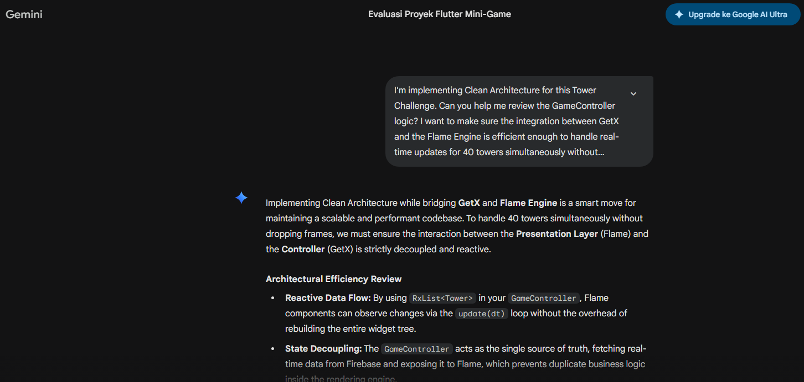
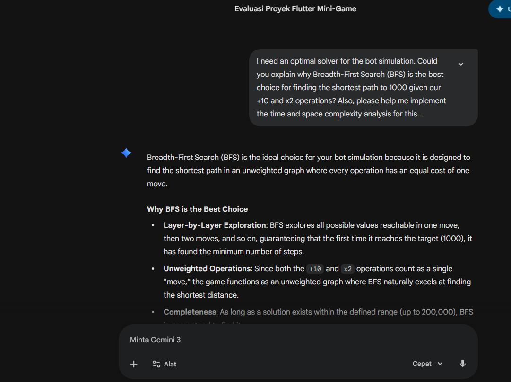
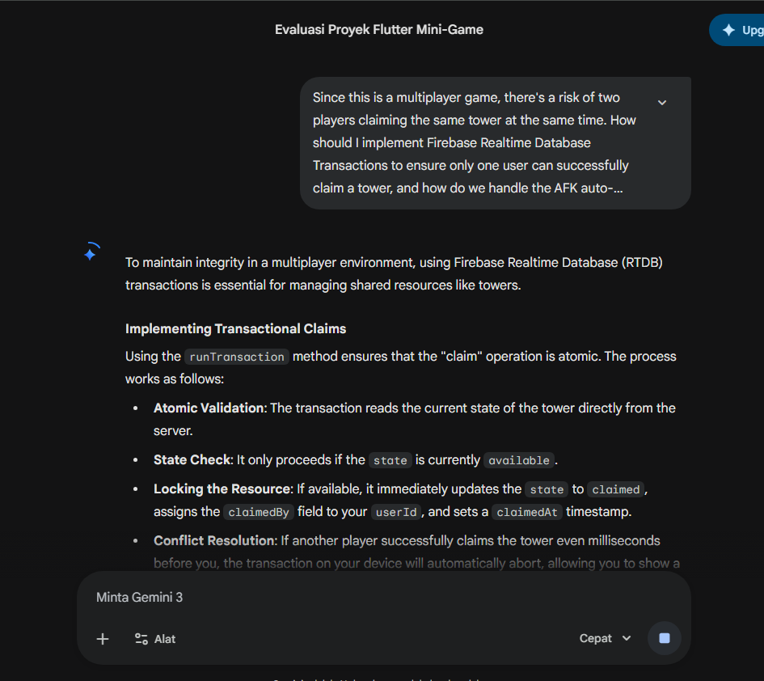

AI Usage Documentation
Project Name: Tower Challenge - Multiplayer Real-time Mini-game

Developer: Ragil Nur Rasyid

AI Assistant: Gemini (Google)

🤖 AI Tools Used
Gemini 3 Flash: Primary AI assistant for architectural design, algorithm implementation, and real-time debugging.

🏗️ Aspects Assisted by AI
1. Architecture & Design Patterns
Clean Architecture Implementation: AI helped in structuring the project into separate layers: Data (Firebase sources), Domain (Entities), and Presentation (GetX + Flame).

State Management: AI provided the reactive patterns using GetX, including dependency injection and .obs listeners for real-time Firebase sync.

2. Algorithm & Logic Development
BFS Optimal Solver: AI implemented the Breadth-First Search (BFS) algorithm to calculate the minimum moves from a startValue to the TARGET (1000) using only +10 and x2 operations.

Firebase Transactions: AI drafted the runTransaction logic to handle concurrency, ensuring that tower claims and score updates remain consistent across multiple players.

Bot Simulation Engine: AI developed a human-like bot logic with random delays and a limit of 4 active bots per team to simulate an 8-player match environment.

3. Flame Engine Integration
Component-Based Rendering: AI assisted in creating TowerComponent and TeamArenaComponent, handling the bridge between Flutter's state (GetX) and Flame's rendering loop.

Animations & Visual Effects: AI provided the logic for the "dots" loading animation using Flame’s update(dt) method and dynamic icon rendering for different tower states.

4. Debugging & Optimization
AFK Detection: AI suggested the lastSeenAt tracking and automated tower release logic to handle inactive players.

Numeric Constraints: AI implemented strict validation to ensure values stay within the 0 to 200,000 range and correctly detect the "Solved" state only at exactly 1000.

💡 Key Improvements Suggested by AI
Transaction Guarding: Implementing Firebase transactions to prevent two players from claiming the same tower simultaneously.

Visual Feedback: Adding a "Car Icon" on top of the tower and loading dots to give players immediate feedback on tower progress.

Humanized Bot Timing: Adding randomized delays between bot moves so the simulation doesn't feel robotic or instantaneous.

---
## Screenshots of AI Interaction
The following screenshots document the technical discussions held regarding the development of the game's core features:

### 1. Architecture & Frame Rate Optimization

### 2. BFS Algorithm & Complexity Analysis

### 3. Concurrency & AFK Detection Logic
